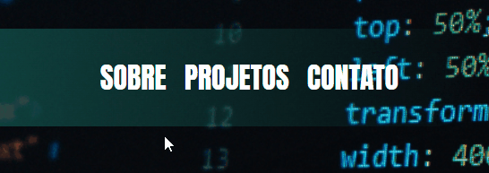
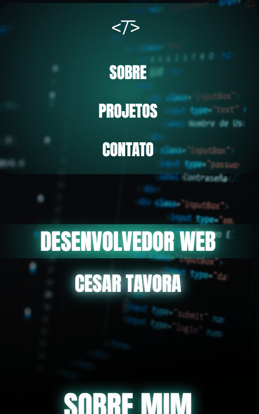

<h1>🌐 Portfólio Pessoal — Cesar Tavora</h1>

  Projeto de portfólio desenvolvido com foco em <strong>desenvolvimento front-end moderno</strong>, utilizando
  <strong>HTML5 e CSS3</strong>, com ênfase em <strong>layout responsivo, organização de código, semântica e performance</strong>.
  O objetivo principal é apresentar minha identidade profissional, minha stack de tecnologias e meus projetos práticos.

  

  🔗
  <a href="#" target="_blank">
    <strong>Acesse o portfólio em produção</strong>
  </a>

<h2>📌 Visual do Projeto</h2>

O projeto é estruturado nas seguintes seções:

<ul>
  <li>Seção Hero com identidade visual e apresentação</li>
  <li>Seção Sobre Mim com descrição profissional e acadêmica</li>
  <li>Seção de Projetos com exemplos reais de aplicações</li>
  <li>Seção de Contato com links diretos</li>
</ul>

<h2>✨ Funcionalidades</h2>
<ul>
  <li>Layout totalmente responsivo</li>
  <li>Navegação com rolagem suave</li>
  <li>Uso de Flexbox para organização estrutural</li>
  <li>Estrutura semântica com HTML5</li>
  <li>Efeitos visuais com gradientes, brihlos e sombras de texto</li>
    

  
  

  <li>Adaptação completa para dispositivos móveis via Media Queries</li>
  

  

  
</ul>

<h2>🛠️ Tecnologias Utilizadas</h2>
<ul>
  <li>HTML5</li>
  <li>CSS3</li>
  <li>JavaScript</li>
  <li>Flexbox</li>
  <li>Google Fonts</li>
  <li>Font Awesome</li>
</ul>

<h2>🎯 Objetivo do Projeto</h2>

  Este projeto foi desenvolvido com o objetivo de consolidar meus conhecimentos em
  <strong>desenvolvimento front-end</strong>, aprimorar a <strong>criação de layouts responsivos</strong>,
  fortalecer a <strong>organização de código</strong> e construir um
  <strong>portfólio profissional real</strong> para apresentação a empresas e recrutadores.

<h2>🚀 Como Visualizar o Projeto</h2>

<h3>✅ Online (Deploy)</h3>

  <a href="#" target="_blank">
    Acesse aqui!
  </a>

<h3>✅ Localmente</h3>
<ol>
  <li>Baixe ou clone o repositório</li>
  <li>Abra o arquivo <code>index.html</code> no navegador</li>
</ol>

<h2>🔗 Links</h2>

  <strong>Repositório do Projeto:</strong> 
  <a href="https://github.com/CesarTavora" target="_blank">
    https://github.com/CesarTavora
  </a>

<h2>👨‍💻 Autor</h2>

  Desenvolvido por <strong>Cesar Tavora</strong> 
  Estudante de <strong>Engenharia de Software</strong>, com foco em
  <strong>Desenvolvimento Web</strong>.

